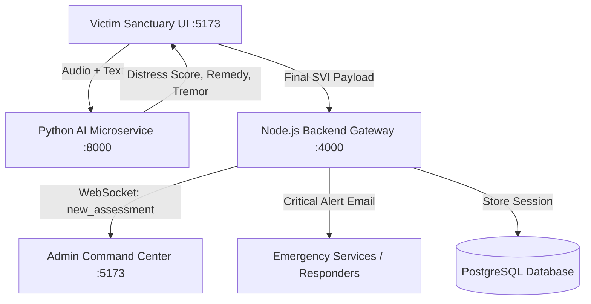

# 🧠 PROJECT MEMORY: Samvedna [NHAA] Stress & Trauma Assessment Platform

*Last Updated: September 2026*  
*Project ID: Smart India Hackathon (SIH) - Real-Time Trauma Counseling & Stress Vulnerability Index (SVI)*

---

## 1. Executive Summary & Core Mission

**Samvedna [NHAA]** (संवेदना — signifying deep empathy and shared emotional support) is an autonomous, multi-modal crisis intervention and psychological stress assessment platform.

### Core Objectives
1. **Victim Trauma Sanctuary (`/assessment`)**:
   - Acts as a safe, deeply empathetic trauma companion.
   - Engages the victim in natural, human-like dialogue, using evidence-based de-escalation techniques (somatic grounding, cognitive validation, gentle pacing).
   - Measures real-time distress on every turn (`Current Distress: X.X/10`, emotion tag, vocal tremor indicator).
   - **Victim Privacy Guard**: The final clinical diagnostic report is **never displayed to the victim** to prevent re-traumatization and clinical labeling anxiety. Upon concluding, the victim enters a calming sanctuary with a 60-second physiological sigh breath guide and 24/7 human helplines (988 & 741741).

2. **Admin Command Center (`/dashboard`)**:
   - Receives encrypted real-time assessments and transcripts via WebSockets.
   - Generates the full **Samvedna [NHAA] Clinical Trauma & Stress Vulnerability Dossier** containing multi-dimensional stress scores, physical vocal tremor analytics, identified trauma triggers, synthesized clinical narratives, and responder roadmaps.
   - Features one-click confidential dossier export (`.txt`) and emergency dispatch simulation with GPS location tracking.

3. **Design Aesthetic**:
   - Calming, modern, light-themed glassmorphism (`bg-gradient-to-br from-slate-50 via-teal-50/20 to-indigo-50/25`).
   - Frosted backdrop panels, fluid floating gradient orbs, and micro-animations for high-stress emotional stabilization.

---

## 2. Microservice Architecture & Tech Stack

### Port Allocation
- **React Frontend**: `http://localhost:5173` (Vite, React 19, Tailwind CSS v4, Lucide Icons, Recharts)
- **Node.js Gateway**: `http://localhost:4000` (Express, Prisma ORM, Socket.io, Nodemailer)
- **Python AI Microservice**: `http://localhost:8000` (FastAPI, Uvicorn, Hugging Face Transformers, Librosa, Google Gemini SDK)

---

## 3. Component Deep Dive

### 3.1 Python AI Microservice (`ai-microservice`)
- **Location**: `d:\PROJECT\sih-stress-assessment\ai-microservice`
- **Core Engine**: `ml/stress_analyzer.py` (`StressAnalyzer` class)
- **Main Server**: `main.py`
- **Machine Learning Models**:
  - **Text Emotion Classifier**: Hugging Face `j-hartmann/emotion-english-distilroberta-base` (evaluates 7 emotions: fear, anger, sadness, disgust, surprise, neutral, joy).
  - **Acoustic Analyzer (`librosa`)**: 
    - Average vocal pitch (fundamental frequency $F_0$ via `piptrack` / parabolic interpolation).
    - Pitch instability & voice cracking (pitch standard deviation > 38 Hz).
    - Physical vocal tremor & breathiness (low-frequency amplitude modulation 4-8 Hz & energy distribution).
    - Zero-Crossing Rate (ZCR) for vocal strain and hyperventilation detection.
  - **Generative Crisis Counselor & Multilingual Engine**:
    - System prompt identity: **Samvedna [NHAA]**.
    - Employs 4 therapeutic phases: *Intake & Check-in* (Turns 1-2), *Root Cause & Exploration* (Turns 3-4), *Emotional Validation & Resilience* (Turns 5-6), *Coping & Grounding* (Turns 7+).
    - **Context-Aware Response Architecture** (CRITICAL — never revert to canned/random responses):
      - **Primary (Gemini)**: Uses proper multi-turn `contents` array with `system_instruction` separation. Passes full conversation history as alternating `user`/`model` Content objects. System instruction enforces language matching based on explicit UI language selection (`language` parameter). Temperature 0.85, max 300 tokens.
      - **Fallback (Topic Extraction Engine)**: When Gemini is unavailable, extracts subjects (discrimination, legal reporting, work, relationship, family, school, trauma, grief, anxiety, sleep, loneliness, money, health) and feelings using regex whole-word boundaries (`\b`) to prevent false substring matches (e.g. "son" in "person" or "hum" in "humiliating").
      - **Strict Language Routing**: User-selected language (`language` parameter, e.g. `en-IN`) takes absolute precedence. English selections are strictly locked to English responses—never falling through to Hindi or Spanish. Devanagari script and whole-word Romanized Hindi detection are only evaluated if no explicit language was passed.
      - **Discrimination & Incident Reporting**: Special compassionate handling for victims reporting discrimination, slurs, or harassment, providing both emotional validation and actionable guidance on filing e-FIRs or written complaints at police stations.
    - **Offline Multilingual Speech-to-Text (`openai/whisper-tiny`)**:
      - Integrated directly in `StressAnalyzer.transcribe_audio()`.
      - Provides 100% offline, local speech recognition across English, Hindi, Spanish, Bengali, and 90+ languages when Gemini is unconfigured or browser Web Speech encounters network limitations.
  - **Emergency Lethality Overrides**: Multilingual regex triggers for weapons, self-harm, fire, suicide across English, Hindi, Hinglish, Spanish, Bengali, Marathi, Telugu, Tamil (`CRITICAL` SVI clamped to 10.0). Normal sadness/stress does NOT trigger crisis mode.
- **Key Endpoints**:
  - `GET /health`: Health check and model readiness probe.
  - `POST /api/analyze`: Multipart endpoint accepting `text`, `history`, `language`, and optional `.wav` audio. If text is omitted, auto-transcribes audio via Whisper; returns turn SVI, cumulative SVI, confidence percentage, emotion breakdown, audio metrics, and Samvedna [NHAA]'s therapeutic response.
  - `POST /api/transcribe`: Dedicated multilingual audio transcription endpoint accepting `audio` file and optional `language` code hint.
  - `POST /api/final-report`: Synthesizes complete longitudinal conversational history into the clinical assessment dossier.

### 3.2 Node.js Gateway (`backend-gateway`)
- **Location**: `d:\PROJECT\sih-stress-assessment\backend-gateway`
- **Entrypoint**: `src/index.ts`
- **Routes**:
  - `src/routes/assessment.ts`:
    - `POST /api/assessments`: Saves assessment to PostgreSQL via Prisma; if `riskLevel === 'CRITICAL'`, triggers instant HTML emergency dispatch email via Nodemailer; broadcasts `new_assessment` event via Socket.io.
    - `GET /api/assessments`: Retrieves historical assessment records for dashboard triage.
- **Middlewares**: `src/middlewares/auth.ts` verifies Firebase auth tokens with local JWT development fallback.

### 3.3 React Frontend (`frontend`)
- **Location**: `d:\PROJECT\sih-stress-assessment\frontend`
- **Pages**:
  - `src/pages/Assessment.tsx` (**Victim Sanctuary**):
    - **Universal Multilingual Speech-to-Text**: Dynamic `recognition.lang` switcher supporting 24+ languages:
      - 🇮🇳 *Indian Regional*: हिन्दी (`hi-IN`), English India (`en-IN`), বাংলা (`bn-IN`), मराठी (`mr-IN`), తెలుగు (`te-IN`), தமிழ் (`ta-IN`), ગુજરાતી (`gu-IN`), ಕನ್ನಡ (`kn-IN`), മലയാളം (`ml-IN`), ਪੰਜਾਬੀ (`pa-IN`), اردو (`ur-IN`).
      - 🌍 *Global*: English US/UK, Español, Français, Deutsch, العربية, 中文, 日本語, Русский, Português, Italiano, 한국어, Türkçe, Bahasa Indonesia.
    - **Genuine 16kHz PCM 16-bit WAV Audio Engine**: Uses Web Audio API (`AudioContext` + `ScriptProcessorNode`) and client-side WAV encoder to capture pure PCM 16-bit WAV audio, decodable directly by Librosa, SoundFile, and Whisper with zero external ffmpeg requirements.
    - **Dual-Layer Speech Recognition**:
      - Real-time live transcription via Web Speech API (`continuous: false` with auto-restart).
      - Guaranteed fallback: upon microphone stop, recorded 16kHz WAV is sent to `/api/transcribe` with `language: selectedLang` to transcribe offline with `openai/whisper-tiny`.
    - **Explicit Language Passing**: All requests to `/api/analyze` include `language: selectedLang` to enforce correct response language.
    - Per-message distress score bubble with emotion tag and vocal tremor badge.
    - Grounding breathwork component (Physiological sigh: double inhale 4s, hold 1s, extended exhale 6s).
    - 24/7 Lifeline contact triggers (988 and 741741).
  - `src/pages/Dashboard.tsx` (**Admin Command Center**):
    - Light glassmorphic aesthetic matching the victim interface.
    - Live WebSocket listener (`new_assessment`) for real-time incident streaming without page reload.
    - Real-time KPI cards: Total Sessions, Critical Alerts, Samvedna [NHAA] AI Engine status, Vocal Acoustic engine status.
    - Recharts incident distribution and risk visualization.
    - Full-featured **Clinical Stress Assessment Dossier** modal:
      - Multi-dimensional breakdown (Emotional heaviness, Physical vocal tension, Cognitive overwhelm).
      - Acoustic tremor indicators (tremor presence, pitch in Hz, acoustic strain).
      - Identified trauma trigger themes.
      - Synthesized clinical narrative.
      - Actionable intervention directives for clinical crisis teams.
      - Emergency responder dispatch action with GPS coordinate links.
      - One-click export to confidential `.txt` dossier.

---

## 4. Algorithmic Formulations

### 4.1 Stress Vulnerability Index (SVI) Formula
The turn score $S_{\text{turn}} \in [0.0, 10.0]$ is computed as:
$$S_{\text{turn}} = \sum_{i} (w_i \cdot P(\text{emotion}_i)) + P_{\text{acoustic}}$$
Where emotion weights $w_i$:
- `fear`: 10.0
- `anger`: 8.0
- `sadness`: 7.0
- `disgust`: 6.0
- `surprise`: 5.0
- `neutral`: 1.0
- `joy`: 0.0

### 4.2 Acoustic Penalties ($P_{\text{acoustic}} \le 2.5$)
- High Average Pitch ($F_0 > 260\text{ Hz}$): $+0.8$
- Pitch Instability ($\sigma_{F0} > 38\text{ Hz}$): $+0.7$
- Vocal Tremor / Shiver: $+0.7$
- Elevated ZCR ($> 0.14$): $+0.5$

### 4.3 Cumulative SVI Exponential Smoothing
$$\text{SVI}_{\text{cumul}} = \alpha \cdot S_{\text{turn}} + (1 - \alpha) \cdot \text{SVI}_{\text{prev}}$$
Where smoothing factor $\alpha = 0.35$.

### 4.4 Assessment Confidence Scaling
$$\text{Confidence}(n) = \min(98.0, 25.0 + 13.0 \cdot n + (15.0 \text{ if audio present}))$$
Where $n$ represents the conversational turn count. Confidence exceeds 90% as dialogue progresses beyond 5 turns.

---

## 5. 1-Click Operational Scripts

| Script | Purpose | Command |
| :--- | :--- | :--- |
| **`run.bat`** | Boots Python AI (:8000), Node Gateway (:4000), React Frontend (:5173), and opens Google Chrome to `/assessment`. | Double-click `run.bat` in root |
| **`stop.bat`** | Kills all background processes listening on ports 8000, 4000, and 5173. | Double-click `stop.bat` in root |

---

## 6. Verification & Test Suite Summary

- **Therapist Dialogue & SVI Convergence Test**:
  - Run command: `python ai-microservice/test_therapist_model.py`
  - Validates:
    1. Vocal acoustic analysis (calm vs. stressed audio).
    2. Multi-turn longitudinal dialogue progression (Turns 1-6) ensuring confidence growth and compassionate empathetic questions.
    3. Emergency heuristic lethal phrase override (immediate CRITICAL clamp).
  - Status: **ALL TESTS PASSED**.

- **Frontend Build & Bundle**:
  - Run command: `npm run build` in `frontend`
  - Output: `tsc -b && vite build` built in < 2.0s with **0 errors**.

- **API Endpoint Health**:
  - `GET http://localhost:8000/health` -> `{"status":"OK","message":"AI Microservice is running!"}`
  - `POST http://localhost:8000/api/analyze` -> Returns SVI and Samvedna [NHAA] remedy.
  - `POST http://localhost:8000/api/final-report` -> Generates full clinical dossier.
  - `POST http://localhost:4000/api/assessments` -> Saves session and broadcasts WebSocket alert.

---

## 7. Crucial Guidelines for Future Maintenance

1. **Preserve Name Integrity**: Always use **Samvedna [NHAA]** for all persona headers, greetings, system prompts, and exported dossiers. Never revert to "Elena" or bare "[NHAA]".
2. **Never Show Clinical Reports to the Victim**: Keep the safe handover sanctuary screen on `/assessment`. Clinical reports belong strictly on the `/dashboard` for emergency responders.
3. **Keep Per-Message Stress Indices**: Retain message distress indicators (`Current Distress: X.X/10`, emotion tag, and vocal tremor shaking badge) on each chat bubble so victims understand their real-time state.
4. **Light Glassmorphic Design Consistency**: Maintain soft gradients, frosted cards, and subtle animations across both victim and admin portals.
